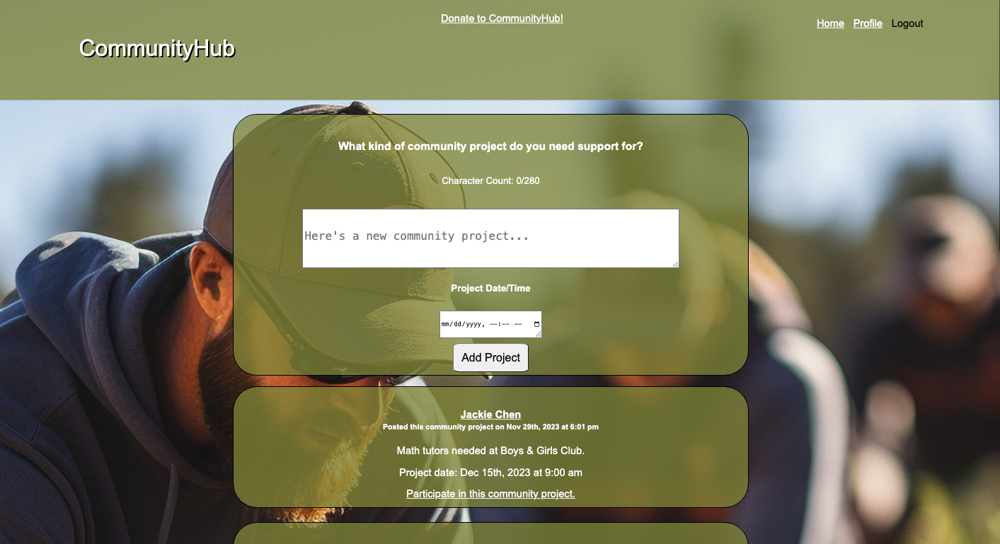

# CommunityHub

## Description

CommunityHub is a web application where community organizers can post neighborhood projects needing volunteer support.

## Table of Contents

* [Usage](#usage)

* [License](#license)

* [Contributors](#contributors)

* [Credits](#credits)

* [Questions](#questions)

## Usage

Follow [this](https://immense-reef-17910-d38955511dce.herokuapp.com/) link to open the application.

On opening the application, you will see the following page:

From here, the user can login or signup. They are also able to view the list of posted community needs, but will be unable to participate until they have logged in or signed up. Once the user has created their account, they will then be able to create their own need and post it onto the community board. They will also be able to sign up to participate in a community project by clicking on the 'Participate in this community project' link. The user will also have access to their Profile page, where they can see a list of their own posted needs and remove them if so desired.

## License

N/A

## Contributors

## Credits

N/A

## Questions

If you have any questions about the repo, open an issue or contact me directly. You can find more of my work at [jb6131](https://github.com/jb6131/).